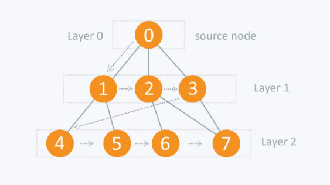

# 8 Puzzle Problem Solver

The task is to implement Breath First Search [BFS] algorithm to solve a 8 Puzzle Problem. It is played on a 3-by-3 grid with 8 square blocks labeled 1 through 8 and a blank square, labelled as 0. The puzzle is solved by arranging the blocks in the right order. You are permitted to slide blocks horizontally or vertically into the blank square.

#### 8 Puzzle Grid:

  

### Breath First Search

The algorithmic solution I implement to solve this problem is Breath First Search [BFS]. BFS is a traversing algorithm where you start traversing from a selected node and traverse the graph layerwise thus exploring the neighbour/child nodes. 

In this problem, each tile configuration is a state. The states are altered by swapping the blank tile with a neaighbouring tile in one in four directions if feasable. The search sequence is Up, Right, Down, Left.

#### BFS Tree:   

  

### Acknowledgements

 - [BFS - Algorithm](https://www.hackerearth.com/practice/algorithms/graphs/breadth-first-search/tutorial/)
 - [8 Puzzle Problem](https://www.d.umn.edu/~jrichar4/8puz.html)
